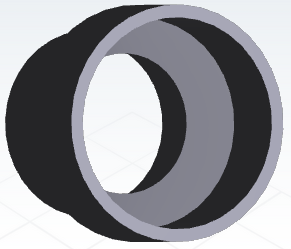
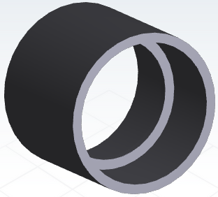
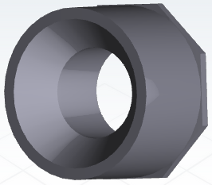
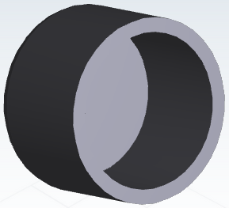

# AutoCatFeeder (documentation wip)
https://user-images.githubusercontent.com/84751257/131232899-d527ca58-03d3-4659-abf9-56b4af570d01.mp4

# Materials
This project uses various PVC fittings and pipe to serve as the hopper for cat food. The hopper can be as small or as large as you would like since it is one solid piece of 4" pvc, although with more than a week or two of food in the tube it may get stale. I will try to list the parts in a way that is easy to search for on various hardware sites. Pictures will not match the actual product in most cases so it would be best to go to a store to make sure you get the right pieces if you want to copy this project exactly.
# 

Materials

  4" x 3" PVC Coupling
 
  
 
  3" x 3" PVC Coupler
 
  
 
  3" x 1-1/2" PVC Bushing
 
  
 
  1-1/2" PVC 45 Degree Y (Wye)
 
  .png)
 
  1-1/2" PVC Slip Cap (Quantity: 2)
 
  

  
